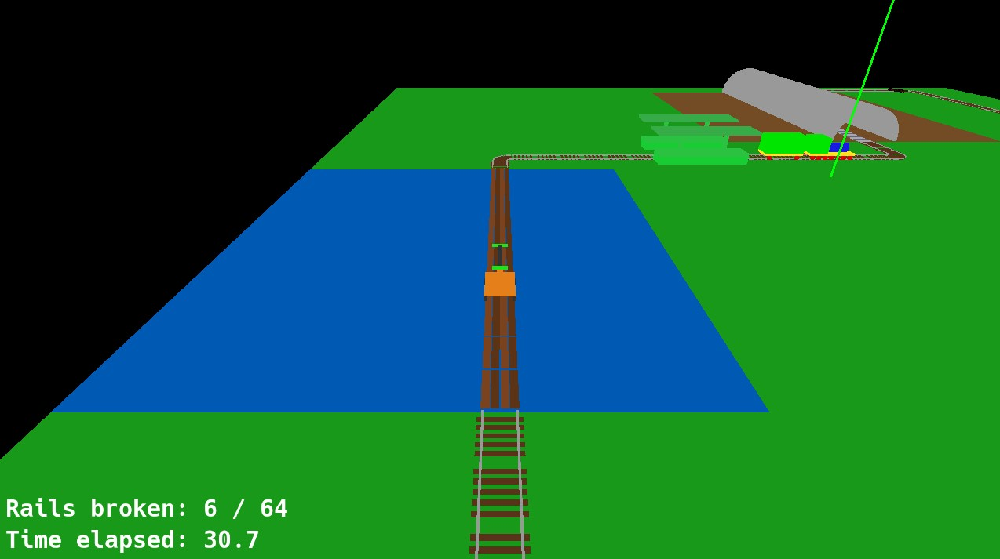

# 🚂 3D Train Rail Maintenance

A 3D mini-game built with **OpenGL** and **C++** where the player drives a hand-pumped draisine along a rail network, racing to repair broken track segments before the trains grind to a halt.




---

## 🎮 Gameplay

You play as a railway mechanic tasked with keeping a rail network in working order.

- **Drive the draisine** (`W` / `S`) along the predefined track to reach damaged segments.
- **Repair broken rails** by pressing `F` when close to an avaria — the segment is restored instantly.
- **Keep the trains running** — an autonomous train circulates the loop and will **stop** when it encounters a broken rail.
- **Zoom** the camera in/out with the **mouse scroll wheel**.

### Lose Conditions

| Condition | Threshold |
|---|---|
| Train stuck on broken rail for too long | **30 seconds** |
| More than half of all rail segments broken simultaneously | **> 50%** |

A **Game Over** screen displays the total survival time.

---

## 🗺️ World & Track

- **40 × 40 tile grid** with three terrain types: 🟩 grass, 🟫 mountain, 🟦 sea.
- **Closed-loop track** featuring 6 corners with smooth quarter-circle arcs, straight stretches over every terrain type, and **mountain tunnels** rendered as half-cylinder arches.
- **3 colour-coded stations** (red, green, blue) placed along the loop.
- Rail visuals adapt to the underlying terrain (standard, mountain supports, sea stilts).

---

## 🔧 Core Features

| Feature | Details |
|---|---|
| **Rail breakage system** | Every 5 s a random intact segment breaks with geometric deformation via a custom vertex shader |
| **Autonomous train** | Locomotive + wagon follow the spline path; stop before broken rails |
| **Player draisine** | Animated hand-car controlled with `W`/`S`; cannot enter broken segments |
| **Third-person camera** | Smooth TPS follow-cam behind the draisine; scroll-wheel zoom (2–20 units) |
| **HUD** | Elapsed time + broken rail counter rendered as on-screen text |
| **Game Over** | Triggered by stuck-train timeout or breakage threshold; displays survival time |
| **Custom GLSL shaders** | `VertexShader.glsl` deforms broken rails procedurally; `FragmentShader.glsl` tints them |

---

## 🏗️ Architecture

```
src/lab_m1/tema2/
├── tema2.cpp / .h        # Main scene – init, update loop, rendering, input
├── train.cpp / .h        # Autonomous train that follows a spline path
├── draisine.cpp / .h     # Player-controlled draisine (movement + animation)
├── meshes.cpp / .h       # Procedural mesh generation (rails, ties, tunnels, etc.)
├── component.cpp / .h    # Composite component (groups meshes with transforms)
└── shaders/
    ├── VertexShader.glsl  # Rail deformation shader (broken rail effect)
    └── FragmentShader.glsl
```
